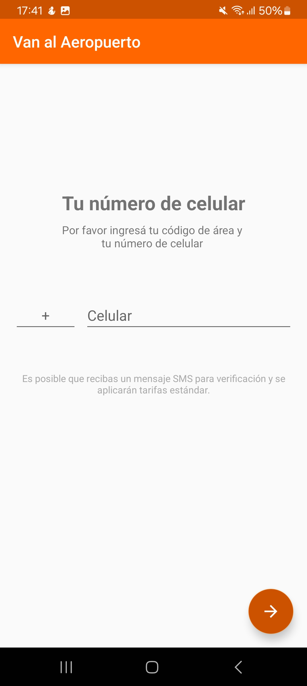
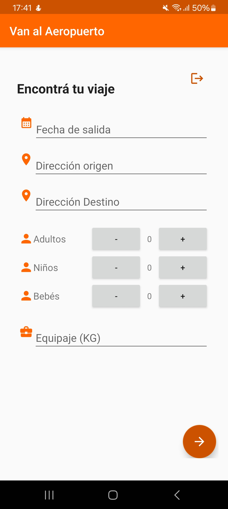
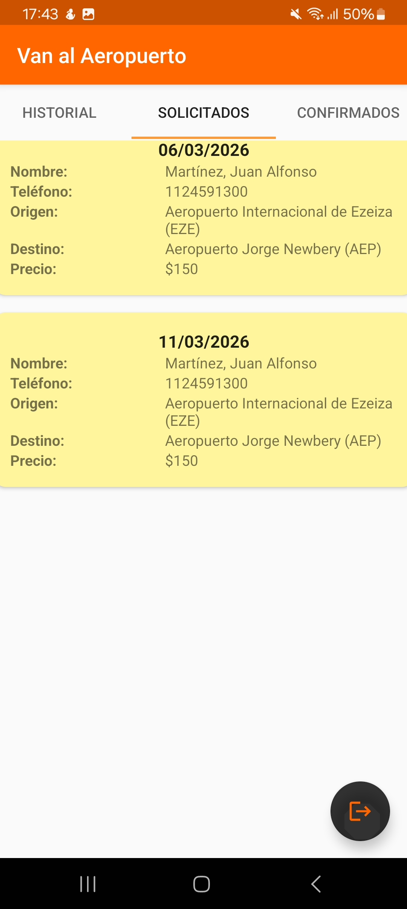
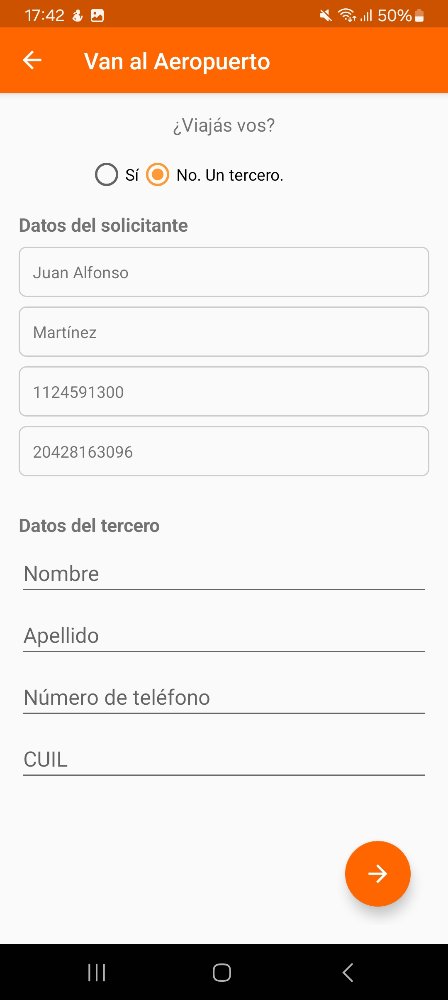

Android Travel Request App

Aplicación Android desarrollada en Kotlin que permite a usuarios solicitar viajes mediante un formulario interactivo.

Tecnologías
- Kotlin
- MVVM
- LiveData
- Navigation Component
- Firebase Auth
- Firestore

Features
- Autenticación de usuarios
- Manejo de sesión persistente
- Roles de usuario (USER / ADMIN)
- Formulario de solicitud de viajes
- Gestor de viajes del lado del cliente
- Validaciones de datos
- Arquitectura MVVM

## Screenshots

### Login

### Home Usuario

### Home Admin

### Formulario de viaje

